VisualCOMET: Reasoning about the Dynamic Context of a Still Image

Jae Sung Park1\,2Chandra Bhagavatula2RoozbechMottaghi1\,2Ali  Farhadi1YejinChoi1\,2

1Paul G\. Allen School of Computer Science & Engineering\, WA\, USA

2Allen Institute for Artificial Intelligence\, WA\, USA

ECCV ‘20

SanheePark

carpediem20@korea\.ac\.kr

Data Intelligence Lab\, Korea University

2021\.03\.16

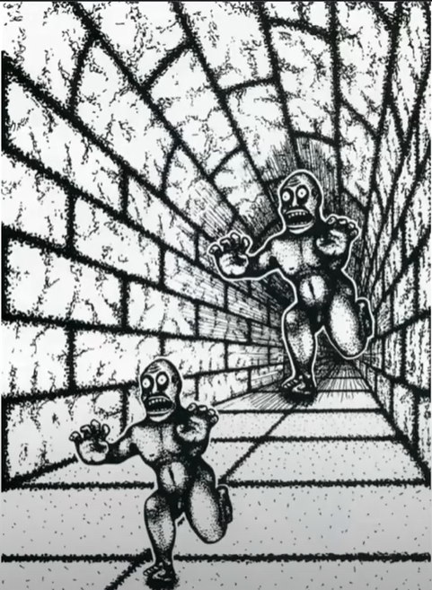

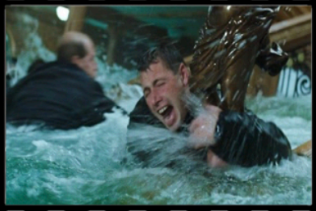

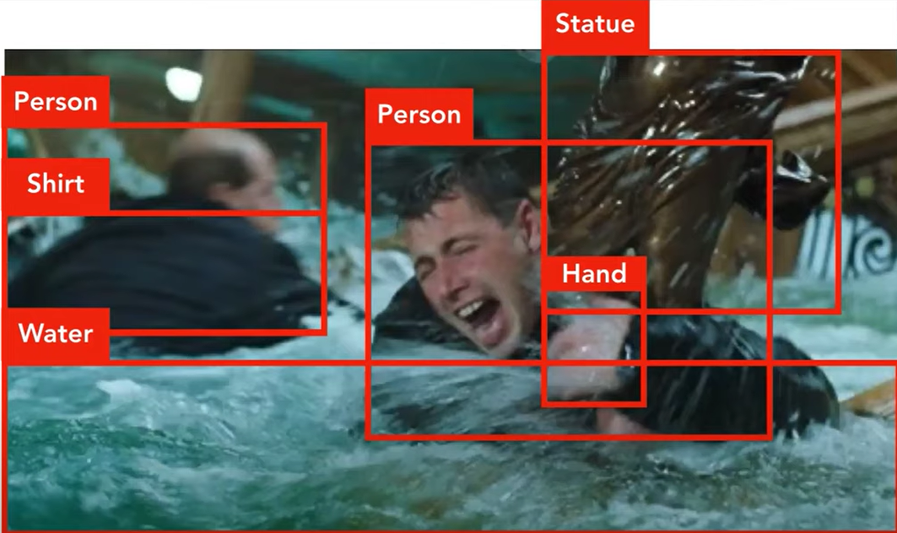

Screen shot from movie

Object detection

Scene graph  \(  johnson et\. al\.2015  krishna et\. al\.\,2016  \)

A man is holding onto a bronze statue in water\.

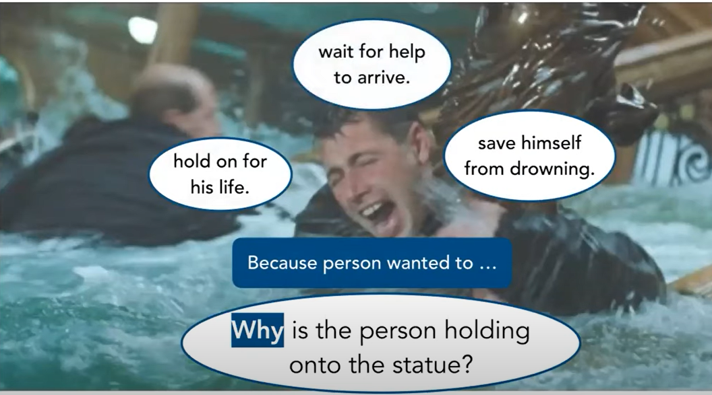

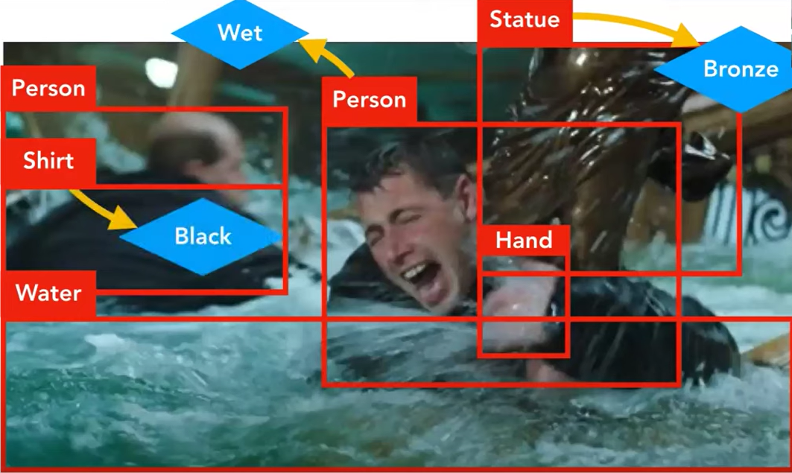

A man is holding onto a bronze statue in water\.

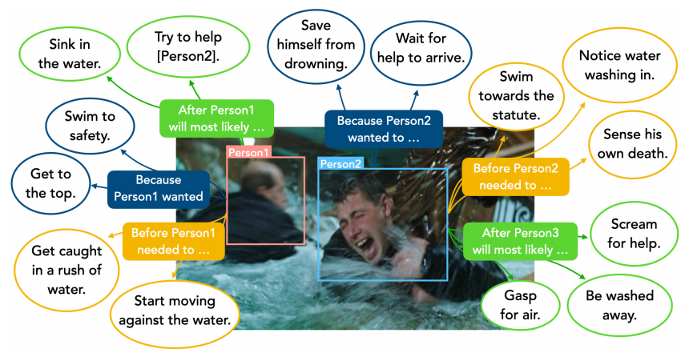

Given a person in the image\,

people can reason about the rich dynamic story underlying the visual scene

Rich background knowledge about how visual world works\, how the social world works

\[2\]Antol\, S\.\, Agrawal\, A\.\, Lu\, J\.\, Mitchell\, M\.\,Batra\, D\.\,Zitnick\, C\. L\.\, & Parikh\, D\. \(2015\)\.Vqa: Visual question answering\. In Proceedings of the IEEE international conference on computer vision \(pp\. 2425\-2433\)\.

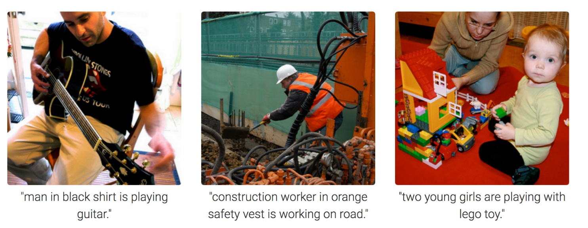

 __Visual Question Answering__    __\[2\]__ 

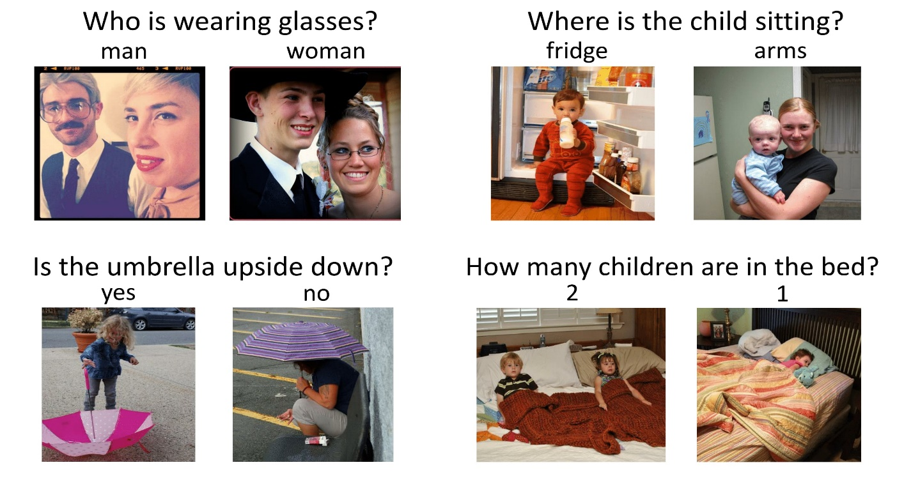

 __Image Captioning__    __\[1\]__ 

 __ Fall short of understanding the dynamic situation\.__ 

\[1\] Lin\, T\. Y\.\,Maire\, M\.\,Belongie\, S\.\, Hays\, J\.\,Perona\, P\.\,Ramanan\, D\.\, \.\.\. &Zitnick\, C\. L\. \(2014\, September\)\. Microsoftacoco: Common objects in context\. In European conference on computer vision \(pp\. 740\-755\)\. Springer\, Cham\.

 __It relies on generic and textual events__ 

 __and does not consider visually contextualized information\.__ 

\[3\]Sap\, Maarten\, et al\. "Atomic: An atlas of machine commonsense for if\-then reasoning\." Proceedings of the AAAI Conference on Artificial Intelligence\. Vol\. 33\. No\. 01\. 2019\.

Problem Statement

How to close gap betweenperception\-levelandcognition\-level

visual understanding?

Theyintroduce a __new task__ of visual commonsense reasoning forcognitive visual scene understanding\, to reason about events before and after and people’s intents at present\.

They present the firstlarge\-scalerepository of Visual Commonsense Graphs that contains more than1Mtextual descriptions ofcommonsense inferencesover 60K complex visual scenes\.

Theyextend the GPT\-2model to incorporate visual information and allow direct supervision for grounding people in images\.

Cognitive image understanding via Visual Commonsense Graph

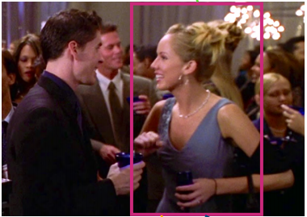

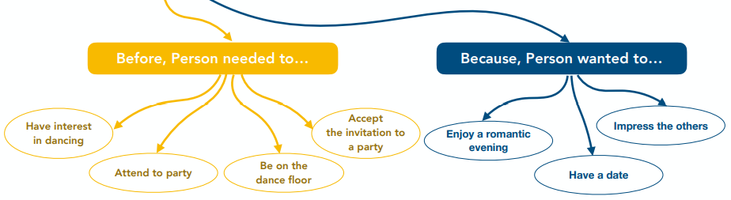

 __Definition of Visual Commonsense Graphs__ 

Cognitive image understanding via Visual Commonsense Graph

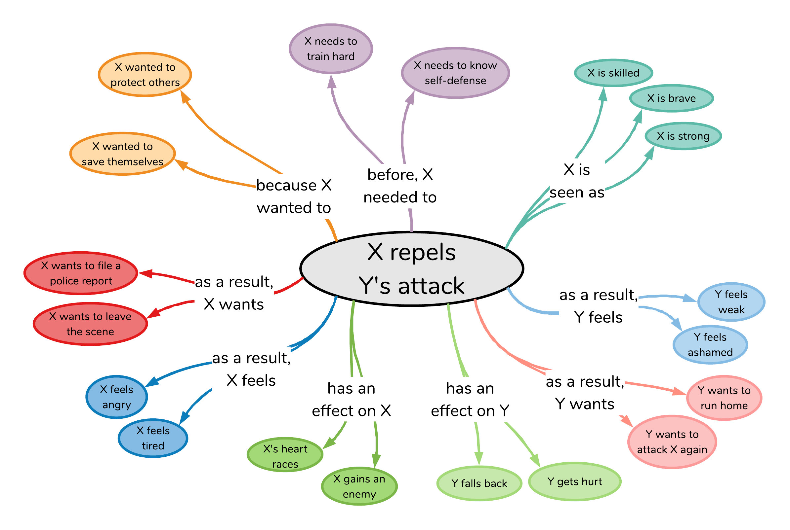

__Inspired__ by designed of ATOMIC\, __if\-then reasoning__

but tailored specifically for __cognitive understanding of visual scene\.__

ATOMIC \(Sap\, M et al\. 2019\)

Definition of Visual Commonsense Graphs

 __Graph consists of four major components\!__ 

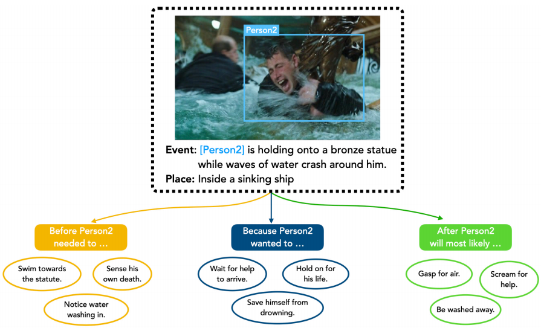

A set of textual descriptions of   __events at present__ 

A set of commonsense inferences on   __events before__ 

A set of commonsense inferences on   __events after__ 

A set of commonsense inferences on people’s   __intents at present__ 

Definition of Tasks

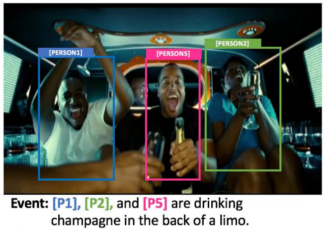

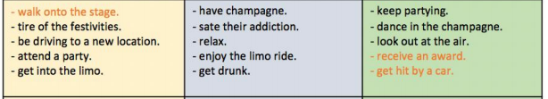

 __Generate the rest of visual commonsense graph__ 

 __that is connected to the specific current event__ 

Definition of Tasks

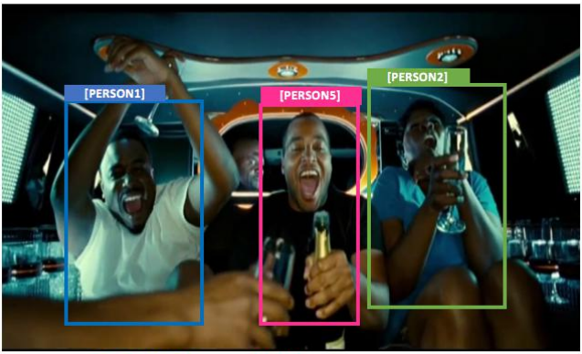

 __Generate the complete set of__ 

 __commonsense inferences from scratch__ 

Dataset Overview

First   __large\-scale dataset__   of Visual Commonsense Graphs for images with   __person grounding__ 

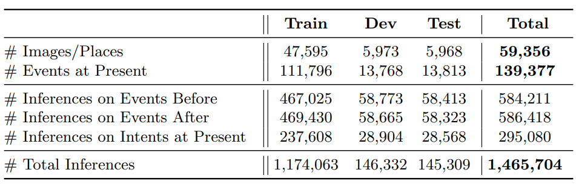

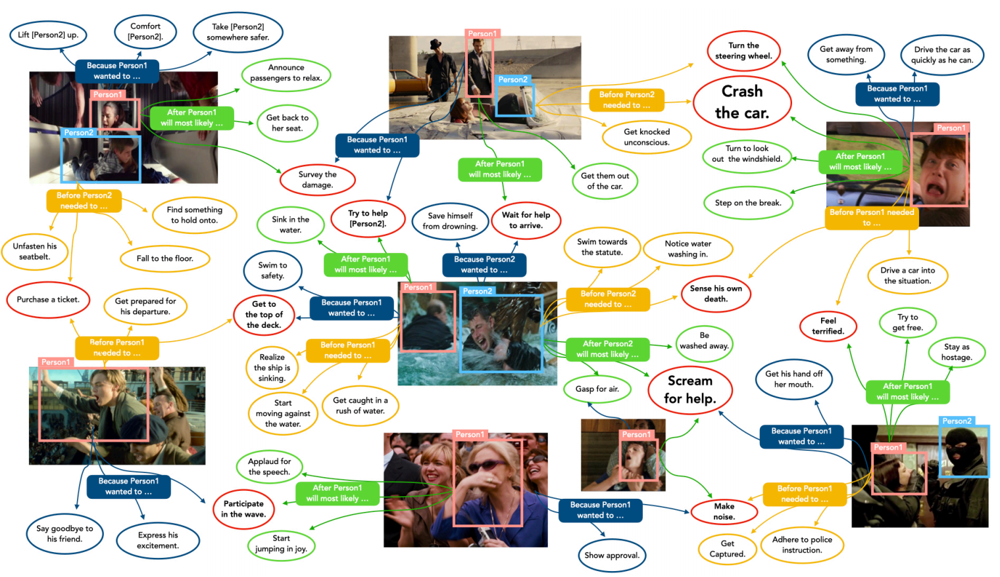

How to Generate?

1\)  Make tags identifying each person in image

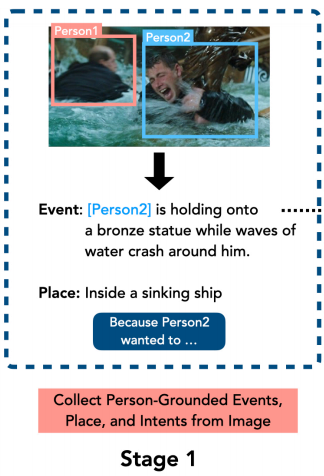

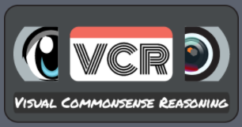

2\) Write event description

Source of images

Complex visual scenes with multiple people and activities

3\) Write intent inferences at the same time

__Stage 1: Grounded event descriptions with locations and intents__

※ For informative annotations\, description event with inferences \!

How to Generate?

Originally\, part of movie scene

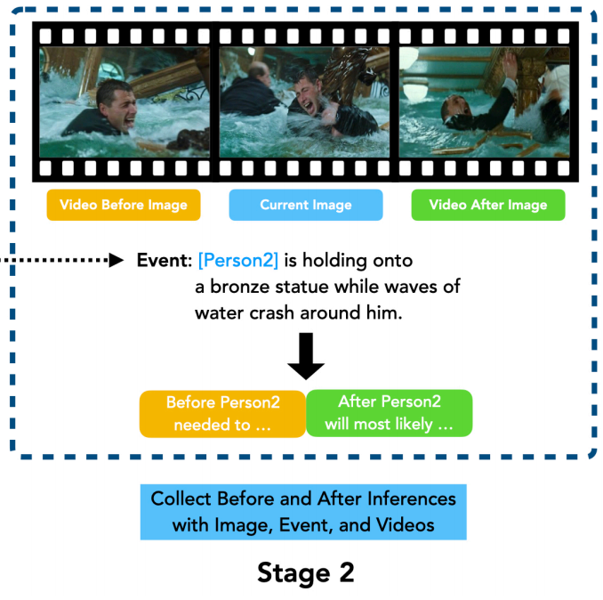

1\) Showcrowdworkersfast\-forwarded clips of events

2\) Two workers for each event\, ask each to annotate

between two and four before and after inferences\.

__Stage 2: Collecting Before and After Inferences__

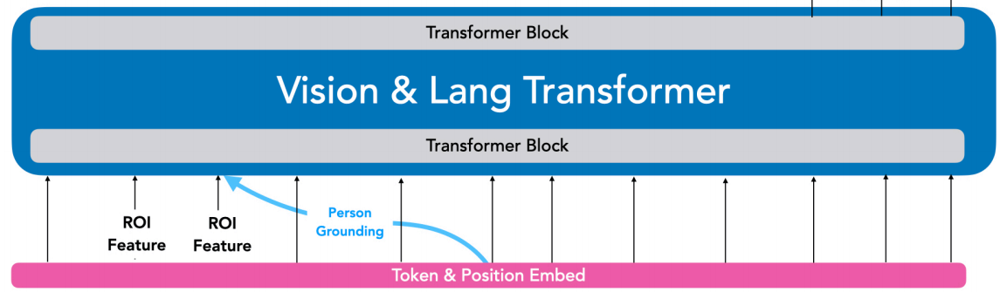

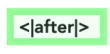

Architecture : Pre\-trained GPT\-2

Single Stream Vision\-Language Transformer

__PG trick : person tag token embedding add to__  __RoI__  __features__

__Sequence of inputs uses special tokens__

__Inference types start token to generate__

Objective function

__ They add EP loss for general version of model__

__\[Datasets\]__

https://visualcomet\.xyz/dataset

Publicly available

Publicly available

https://github\.com/jamespark3922/visual\-comet

Experiments setup

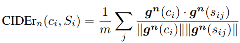

Experiment setup

automatic metric for MT evaluation

Automatic metrics used in image captioning

Inference sentences that are unique

Total number of sentences

Unique : the number of inference sentences that are unique

within the generated sentences\.

Novel : the number of Generated sentences that are not in training data\.

Generated sentences that are not in training data

Total number of sentences

\[4\]Vedantam\, R\.\, LawrenceZitnick\, C\.\, & Parikh\, D\. \(2015\)\. Cider: Consensus\-based image description evaluation\. In Proceedings of the IEEE conference on computer vision and pattern recognition \(pp\. 4566\-4575\)\.

\[5\] Banerjee\,Satanjeev\, and AlonLavie\. "METEOR: An automatic metric for MT evaluation with improved correlation with human judgments\." Proceedings of theaclworkshop on intrinsic and extrinsic evaluation measures for machine translation and/or summarization\. 2005\.

Experiment setup

Automatic Evaluation

BLEU\-2

METEOR

CIDER

Quality of inference sentences

Acc@50

Unique

Novel

Filter out inference that do not match the content in image and event at present

Diversity of sentences

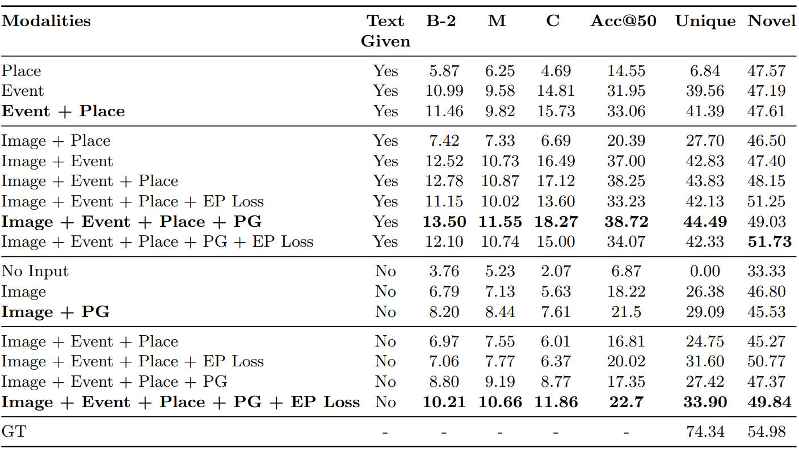

__Visual and textual__

__Modalities outperform__ models trained one modality

__0 \-\-\-\-\-\-\-\-\-\-\-\-\-\- 1__

__likely               unlikely__

Human Evaluation

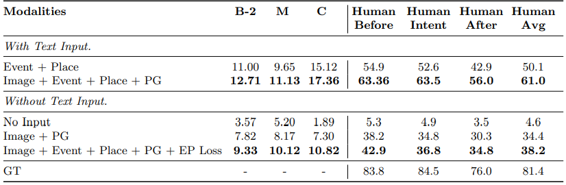

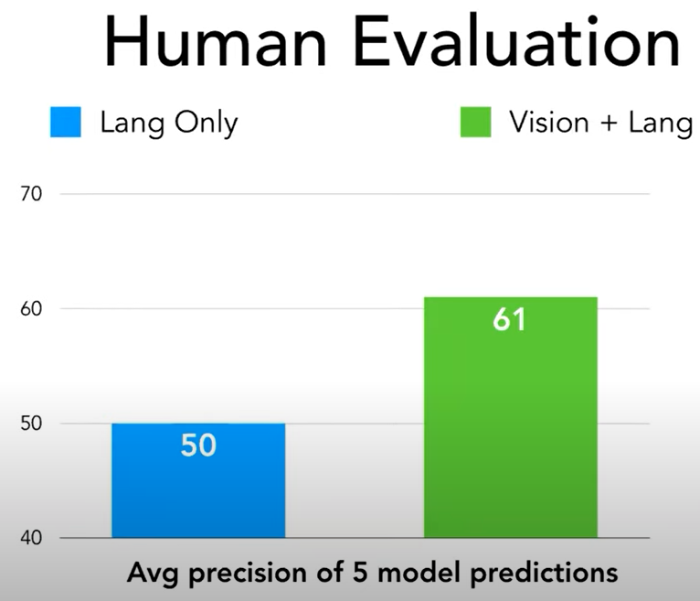

 __Text only model performs better than the Image \+    	Text model without text input in test time\.__

Qualitative Examples

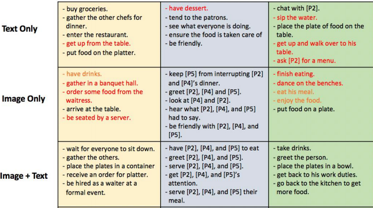

 __They state visual and text modalities generate more consistent and better contextualized predictions\.__

Qualitative Examples

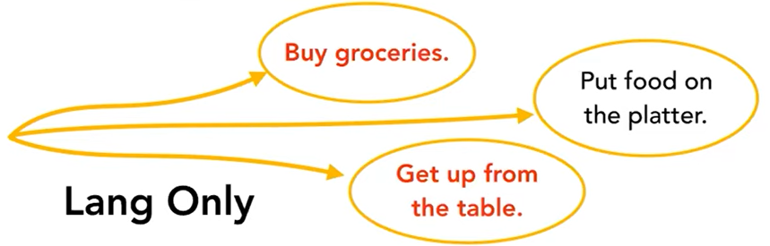

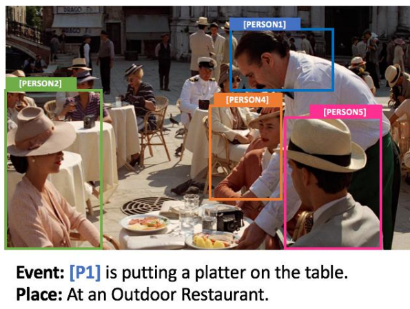

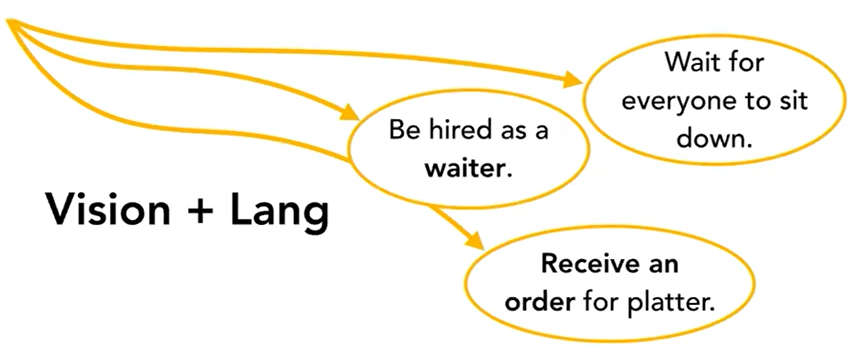

 __They state visual and text modalities generate more consistent and better contextualized predictions\.__

They present Visual Commonsense Graphs\,the first large\-scalerepository of visual commonsense with more than1\.4 millioncommonsenseinferencesover60k imageswith complex visual scenes\.

Promising results that use the power of pre\-trained language to close gap betweenperception\-levelandcognition\-levelvisual understanding\.

The dataset supports new tasks and models beyond what are presented\.

Experiment setup

Baselines based on Different Inputs

\- Same architecture but ablate on the inputs \(place\, event\, and image\)

* Difference between inference and captioning
  * \(a\) generates sentences that are more diverse and rich in content than the captioning models \(b\)\.

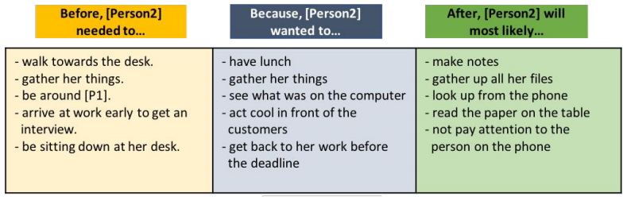

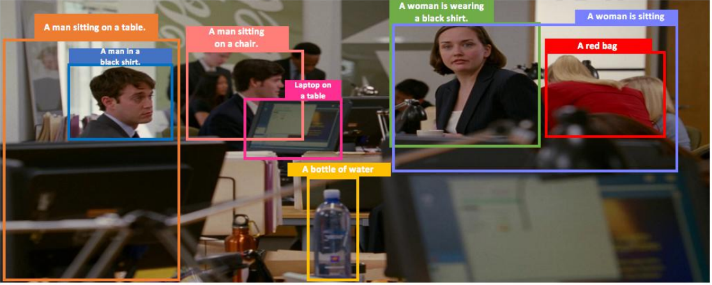

